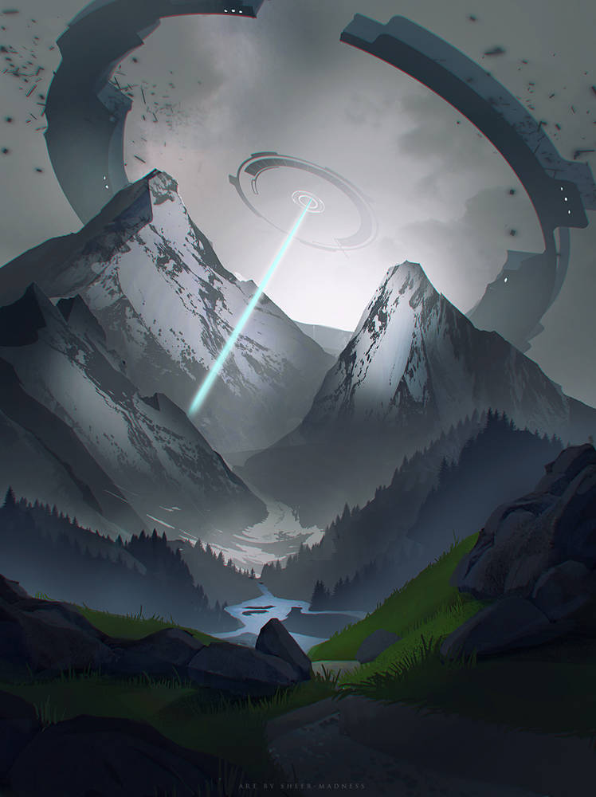

---
hide:
    - navigation
---

# The Northern Gate

The Northern Gate, commonly referred to as "the Gate," is an ancient structure located near the northern pole of Antares, at the borders of the Teethering Maw. This circular portal/gate is notable for being the primary entry point through which the Londoners arrived on Antares for the first time.

## Overview

{ height=400 align=left }

The Northern Gate is rumored to serve as a connection between distant realms or locations separated by great distances. Its exact mechanism and purpose remain largely unknown. Prior to the arrival of the Londoners and the subsequent conflicts, the existence of the Northern Gate was kept secret by the elves who controlled the area. This secrecy was due in part to the Gate's inherent danger; prolonged exposure to its Celestial script and engravings could result in spontaneous combustion, a phenomenon that made the Gate particularly hazardous.

Following the Second Warp Maelstorm, the responsibility for guarding the Northern Gate was largely abandoned. The elves, who had previously maintained a vigilant watch over the Gate, were unable to continue their efforts due to shifting priorities and their eventual defeat by London. As a result, London assumed control of the Gate’s protection. They employ fleets of airship & dreadnoughts which patrols the surrounding region from a secure distance to prevent unauthorized access. The reasons for Londons continued oversight of the Gate remain classified.

The structure is believed to have been constructed by the Precursors and was likely intended to connect Antares to other continents beyond The Mist Veil. However, the precise function of the Gate and the means by which it operates are beyond the current technological and magical understanding of Antares.

The Gate is the subject of various prophecies and theories, which suggest that uncovering its secrets might provide a means of salvation from the Warp. Its complex design and potential for inter-realm connectivity continue to make it a focal point of interest and speculation.

## The Avid Horizon Exclusion Zone

The Avid Horizon Exclusion Zone is a designated area with a radius of 75 kilometers (approximately 245,000 feet) centered around the Northern Gate. This zone is classified as a "No Man’s Land" by the London authorities due to its extreme danger and the hazardous conditions within.

The Exclusion Zone is renowned for being one of the most perilous regions on Antares. Its terrain is predominantly mountainous, which complicates traversal and contributes to the area's high level of risk. Additionally, the region is heavily infested with dangerous Aberrations. While the wilderness of Antares is generally treacherous, areas under London control typically offer higher chances of survival due to rigorous surveillance and patrolling. In stark contrast, the Avid Horizon Exclusion Zone is abandoned to its own perils. The London government maintains a policy of non-intervention, meaning that individuals who stray into this zone are left to face the Aberrations without assistance, even if they are later located.

At the perimeter of the Exclusion Zone, numerous suspended outposts and mobile research stations are strategically positioned. These facilities are responsible for continuously monitoring the activity of the Northern Gate. The structures are heavily fortified and equipped with advanced weaponry to deter and repel unauthorized intrusions. They serve both as a security measure and a deterrent against zealot groups and other entities attempting to enter the zone for pilgrimage or other purposes. These zealots, driven by various motivations—spiritual, ideological, or otherwise—pose a unique threat, as they may attempt to access the Northern Gate despite the risks. The heavily armed outposts act as a critical line of defense, preventing such groups from breaching the Exclusion Zone and ensuring that the Northern Gate remains secure.

However, as time has passed, it has become apparent that the true purpose of the Exclusion Zone extends beyond merely keeping trespassers out. The zone is also intended to prevent whatever lies beyond the Northern Gate from escaping into the broader world.