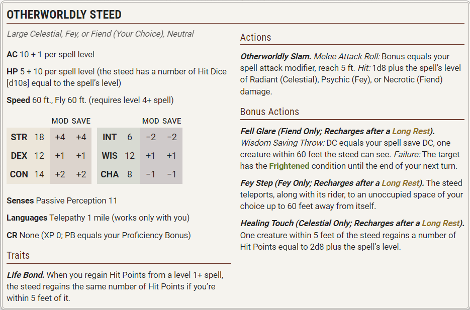

# Spells (F)

---

### Fabricate

*Level 4 Transmutation (Wizard)*

**Casting Time:** 10 minutes  
**Range:** 120 feet  
**Components:** V, S  
**Duration:** Instantaneous

You convert raw materials into products of the same material. For example, you can fabricate a wooden bridge from a clump of trees, a rope from a patch of hemp, or clothes from flax or wool.

Choose raw materials that you can see within range. You can fabricate a Large or smaller object (contained within a 10-foot Cube or eight connected 5-foot Cubes) given a sufficient quantity of material. If you're working with metal, stone, or another mineral substance, however, the fabricated object can be no larger than Medium (contained within a 5-foot Cube). The quality of any fabricated objects is based on the quality of the raw materials.

Creatures and magic items can't be created by this spell. You also can't use it to create items that require a high degree of skill—such as weapons and armour—unless you have proficiency with the type of Artisan's Tools used to craft such objects.

---

### Faerie Fire

*Level 1 Evocation (Bard, Druid)*

**Casting Time:** Action  
**Range:** 60 feet  
**Components:** V  
**Duration:** Concentration, up to 1 minute

Objects in a 20-foot Cube within range are outlined in blue, green, or violet light (your choice). Each creature in the Cube is also outlined if it fails a Dexterity saving throw. For the duration, objects and affected creatures shed Dim Light in a 10-foot radius and can't benefit from the Invisible condition.

Attack rolls against an affected creature or object have Advantage if the attacker can see it.

---

### False Life

*Level 1 Necromancy (Sorcerer, Wizard)*

**Casting Time:** Action  
**Range:** Self  
**Components:** V, S, M (a drop of alcohol)  
**Duration:** Instantaneous

You gain 2d4 + 4 Temporary Hit Points.

***Using a Higher-Level Spell Slot.*** You gain 5 additional Temporary Hit Points for each spell slot level above 1.

---

### Fear

*Level 3 Illusion (Bard, Sorcerer, Warlock, Wizard)*

**Casting Time:** Action  
**Range:** Self  
**Components:** V, S, M (a white feather)  
**Duration:** Concentration, up to 1 minute

Each creature in a 30-foot Cone must succeed on a Wisdom saving throw or drop whatever it is holding and have the Frightened condition for the duration.

A Frightened creature takes the Dash action and moves away from you by the safest route on each of its turns unless there is nowhere to move. If the creature ends its turn in a space where it doesn't have line of sight to you, the creature makes a Wisdom saving throw. On a successful save, the spell ends on that creature.

---

### Feather Fall

*Level 1 Transmutation (Bard, Sorcerer, Wizard)*

**Casting Time:** Reaction, which you take when you or a creature you can see within 60 feet of you falls  
**Range:** 60 feet  
**Components:** V, M (a small feather or piece of down)  
**Duration:** 1 minute

Choose up to five falling creatures within range. A falling creature's rate of descent slows to 60 feet per round until the spell ends. If a creature lands before the spell ends, the creature takes no damage from the fall, and the spell ends for that creature.

---

### Find Familiar

*Level 1 Conjuration (Wizard)*

**Casting Time:** 1 hour or Ritual  
**Range:** 10 feet  
**Components:** V, S, M (burning incense worth 10+ GP, which the spell consumes)  
**Duration:** Instantaneous

You gain the service of a familiar, a spirit that takes an animal form you choose: Bat, Cat, Frog, Hawk, Lizard, Octopus, Owl, Rat, Raven, Spider, Weasel, or another Beast that has a Challenge Rating of 0. Appearing in an unoccupied space within range, the familiar has the statistics of the chosen form (see appendix B), though it is a Celestial, Fey, or Fiend (your choice) instead of a Beast. Your familiar acts independently of you, but it obeys your commands.

***Telepathic Connection.*** While your familiar is within 100 feet of you, you can communicate with it telepathically. Additionally, as a Bonus Action, you can see through the familiar's eyes and hear what it hears until the start of your next turn, gaining the benefits of any special senses it has.

Finally, when you cast a spell with a range of touch, your familiar can deliver the touch. Your familiar must be within 100 feet of you, and it must take a Reaction to deliver the touch when you cast the spell.

***Combat.*** The familiar is an ally to you and your allies. It rolls its own Initiative and acts on its own turn. A familiar can't attack, but it can take other actions as normal.

***Disappearance of the Familiar.*** When the familiar drops to 0 Hit Points, it disappears. It reappears after you cast this spell again. As a Magic action, you can temporarily dismiss the familiar to a pocket dimension. Alternatively, you can dismiss it forever. As a Magic action while it is temporarily dismissed, you can cause it to reappear in an unoccupied space within 30 feet of you. Whenever the familiar drops to 0 Hit Points or disappears into the pocket dimension, it leaves behind in its space anything it was wearing or carrying.

***One Familiar Only.*** You can't have more than one familiar at a time. If you cast this spell while you have a familiar, you instead cause it to adopt a new eligible form.

---

### Find Steed

*Level 2 Conjuration (Paladin)*

**Casting Time:** Action  
**Range:** 30 feet

Component: V, S  
**Duration:** Instantaneous

You summon an otherworldly being that appears as a loyal steed in an unoccupied space of your choice within range. This creature uses the Otherworldly Steed stat block. If you already have a steed from this spell, the steed is replaced by the new one.

The steed resembles a Large, rideable animal of your choice, such as a horse, a camel, a dire wolf, or an elk. Whenever you cast the spell, choose the steed's creature type—Celestial, Fey, or Fiend—which determines certain traits in the stat block.

Combat. The steed is an ally to you and your allies. In combat, it shares your Initiative count, and it functions as a controlled mount while you ride it (as defined in the rules on mounted combat). If you have the Incapacitated condition, the steed takes its turn immediately after yours and acts independently, focusing on protecting you.

Disappearance of the Steed. The steed disappears if it drops to 0 Hit Points or if you die. When it disappears, it leaves behind anything it was wearing or carrying. If you cast this spell again, you decide whether you summon the steed that disappeared or a different one.

***Using a Higher-Level Spell Slot.*** Use the spell slot's level for the spell's level in the stat block.

---

### Find the Path

*Level 6 Divination (Bard, Cleric, Druid)*

**Casting Time:** 1 minute  
**Range:** Self  
**Components:** V, S, M (a set of divination tools—such as cards or runes—worth 100+ GP)  
**Duration:** Concentration, up to 1 day

You magically sense the most direct physical route to a location you name. You must be familiar with the location, and the spell fails if you name a destination on another plane of existence, a moving destination (such as a mobile fortress), or an unspecific destination (such as “a green dragon's lair”).

For the duration, as long as you are on the same plane of existence as the destination, you know how far it is and in what direction it lies. Whenever you face a choice of paths along the way there, you know which path is the most direct.

---

### Find Traps

*Level 2 Divination (Cleric, Druid, Ranger)*

**Casting Time:** Action  
**Range:** 120 feet  
**Components:** V, S  
**Duration:** Instantaneous

You sense any trap within range that is within line of sight. A trap, for the purpose of this spell, includes any object or mechanism that was created to cause damage or other danger. Thus, the spell would sense the Alarm or Glyph of Warding spell or a mechanical pit trap, but it wouldn't reveal a natural weakness in the floor, an unstable ceiling, or a hidden sinkhole.

This spell reveals that a trap is present but not its location. You do learn the general nature of the danger posed by a trap you sense.

---

### Finger of Death

*Level 7 Necromancy (Sorcerer, Warlock, Wizard)*

**Casting Time:** Action  
**Range:** 60 feet  
**Components:** V, S  
**Duration:** Instantaneous

You unleash negative energy toward a creature you can see within range. The target makes a Constitution saving throw, taking 7d8 + 30 Necrotic damage on a failed save or half as much damage on a successful one.

A Humanoid killed by this spell rises at the start of your next turn as a Zombie (see appendix B) that follows your verbal orders.

---

### Fireball

*Level 3 Evocation (Sorcerer, Wizard)*

**Casting Time:** Action  
**Range:** 150 feet  
**Components:** V, S, M (a ball of bat guano and sulfur)  
**Duration:** Instantaneous

A bright streak flashes from you to a point you choose within range and then blossoms with a low roar into a fiery explosion. Each creature in a 20-foot-radius Sphere centered on that point makes a Dexterity saving throw, taking 8d6 Fire damage on a failed save or half as much damage on a successful one.

Flammable objects in the area that aren't being worn or carried start burning.

***Using a Higher-Level Spell Slot.*** The damage increases by 1d6 for each spell slot level above 3.

---

### Fire Bolt
Evocation Cantrip (Sorcerer, Wizard)*

**Casting Time:** Action  
**Range:** 120 feet  
**Components:** V, S  
**Duration:** Instantaneous

You hurl a mote of fire at a creature or an object within range. Make a ranged spell attack against the target. On a hit, the target takes 1d10 Fire damage. A flammable object hit by this spell starts burning if it isn't being worn or carried.

***Cantrip Upgrade.***The damage increases by 1d10 when you reach levels 5 (2d10), 11 (3d10), and 17 (4d10).

---

### Fire Shield

*Level 4 Evocation (Druid, Sorcerer, Wizard)

**Casting Time:** Action  
**Range:** Self  
**Components:** V, S, M (a bit of phosphorus or a firefly)  
**Duration:** 10 minutes

Wispy flames wreathe your body for the duration, shedding Bright Light in a 10-foot radius and Dim Light for an additional 10 feet.

The flames provide you with a warm shield or a chill shield, as you choose. The warm shield grants you Resistance to Cold damage, and the chill shield grants you Resistance to Fire damage.

In addition, whenever a creature within 5 feet of you hits you with a melee attack roll, the shield erupts with flame. The attacker takes 2d8 Fire damage from a warm shield or 2d8 Cold damage from a chill shield.

---

### Fire Storm

*Level 7 Evocation (Cleric, Druid, Sorcerer)*

**Casting Time:** Action  
**Range:** 150 feet  
**Components:** V, S  
**Duration:** Instantaneous

A storm of fire appears within range. The area of the storm consists of up to ten 10-foot Cubes, which you arrange as you like. Each Cube must be contiguous with at least one other Cube. Each creature in the area makes a Dexterity saving throw, taking 7d10 Fire damage on a failed save or half as much damage on a successful one.

Flammable objects in the area that aren't being worn or carried start burning.

---

### Flame Blade

*Level 2 Evocation (Druid, Sorcerer)*

**Casting Time:** Bonus Action  
**Range:** Self  
**Components:** V, S, M (a sumac leaf)  
**Duration:** Concentration, up to 10 minutes

You evoke a fiery blade in your free hand. The blade is similar in size and shape to a scimitar, and it lasts for the duration. If you let go of the blade, it disappears, but you can evoke it again as a Bonus Action.

As a Magic action, you can make a melee spell attack with the fiery blade. On a hit, the target takes Fire damage equal to 3d6 plus your spellcasting ability modifier.

The flaming blade sheds Bright Light in a 10-foot radius and Dim Light for an additional 10 feet.

***Using a Higher-Level Spell Slot.*** The damage increases by 1d6 for each spell slot level above 2.

---

### Flame Strike

*Level 5 Evocation (Cleric)*

**Casting Time:** Action  
**Range:** 60 feet  
**Components:** V, S, M (a pinch of sulfur)  
**Duration:** Instantaneous

A vertical column of brilliant fire roars down from above. Each creature in a 10-foot-radius, 40-foot-high Cylinder centered on a point within range makes a Dexterity saving throw, taking 5d6 Fire damage and 5d6 Radiant damage on a failed save or half as much damage on a successful one.

***Using a Higher-Level Spell Slot.*** The Fire damage and the Radiant damage increase by 1d6 for each spell slot level above 5.

---

### Flaming Sphere

*Level 2 Conjuration (Druid, Sorcerer, Wizard)*

**Casting Time:** Action  
**Range:** 60 feet  
**Components:** V, S, M (a ball of wax)  
**Duration:** Concentration, up to 1 minute

You create a 5-foot-diameter sphere of fire in an unoccupied space on the ground within range. It lasts for the duration. Any creature that ends its turn within 5 feet of the sphere makes a Dexterity saving throw, taking 2d6 Fire damage on a failed save or half as much damage on a successful one.

As a Bonus Action, you can move the sphere up to 30 feet, rolling it along the ground. If you move the sphere into a creature's space, that creature makes the save against the sphere, and the sphere stops moving for the turn.

When you move the sphere, you can direct it over barriers up to 5 feet tall and jump it across pits up to 10 feet wide. Flammable objects that aren't being worn or carried start burning if touched by the sphere, and it sheds Bright Light in a 20-foot radius and Dim Light for an additional 20 feet.

***Using a Higher-Level Spell Slot.*** The damage increases by 1d6 for each spell slot level above 2.

---

### Flesh to Stone

*Level 6 Transmutation (Druid, Sorcerer, Wizard)*

**Casting Time:** Action  
**Range:** 60 feet  
**Components:** V, S, M (a cockatrice feather)  
**Duration:** Concentration, up to 1 minute

You attempt to turn one creature that you can see within range into stone. The target makes a Constitution saving throw. On a failed save, it has the Restrained condition for the duration. On a successful save, its Speed is 0 until the start of your next turn. Constructs automatically succeed on the save.

A Restrained target makes another Constitution saving throw at the end of each of its turns. If it successfully saves against this spell three times, the spell ends. If it fails its saves three times, it is turned to stone and has the Petrified condition for the duration. The successes and failures needn't be consecutive; keep track of both until the target collects three of a kind.

If you maintain your Concentration on this spell for the entire possible duration, the target is Petrified until the condition is ended by Greater Restoration or similar magic.

---

### Fly

*Level 3 Transmutation (Sorcerer, Warlock, Wizard)*

**Casting Time:** Action  
**Range:** Touch  
**Components:** V, S, M (a feather)  
**Duration:** Concentration, up to 10 minutes

You touch a willing creature. For the duration, the target gains a Fly Speed of 60 feet and can hover. When the spell ends, the target falls if it is still aloft unless it can stop the fall.

***Using a Higher-Level Spell Slot.*** You can target one additional creature for each spell slot level above 3.

---

### Fog Cloud

*Level 1 Conjuration (Druid, Ranger, Sorcerer, Wizard)

**Casting Time:** Action  
**Range:** 120 feet  
**Components:** V, S  
**Duration:** Concentration, up to 1 hour

You create a 20-foot-radius Sphere of fog centered on a point within range. The Sphere is Heavily Obscured. It lasts for the duration or until a strong wind (such as one created by Gust of Wind) disperses it.

***Using a Higher-Level Spell Slot.*** The fog's radius increases by 20 feet for each spell slot level above 1.

---

### Forbiddance

*Level 6 Abjuration (Cleric)*

**Casting Time:** 10 minutes or Ritual  
**Range:** Touch  
**Components:** V, S, M (ruby dust worth 1,000+ GP)  
**Duration:** 1 day

You create a ward against magical travel that protects up to 40,000 square feet of floor space to a height of 30 feet above the floor. For the duration, creatures can't teleport into the area or use portals, such as those created by the Gate spell, to enter the area. The spell proofs the area against planar travel, and therefore prevents creatures from accessing the area by way of the Astral Plane, the Ethereal Plane, the Feywild, the Shadowfell, or the Plane Shift spell.

In addition, the spell damages types of creatures that you choose when you cast it. Choose one or more of the following: Aberrations, Celestials, Elementals, Fey, Fiends, and Undead. When a creature of a chosen type enters the spell's area for the first time on a turn or ends its turn there, the creature takes 5d10 Radiant or Necrotic damage (your choice when you cast this spell).

You can designate a password when you cast the spell. A creature that speaks the password as it enters the area takes no damage from the spell.

The spell's area can't overlap with the area of another Forbiddance spell. If you cast Forbiddance every day for 30 days in the same location, the spell lasts until it is dispelled, and the Material components are consumed on the last casting.

---

### Forcecage

*Level 7 Evocation (Bard, Warlock, Wizard)*

**Casting Time:** Action  
**Range:** 100 feet  
**Components:** V, S, M (ruby dust worth 1,500+ GP, which the spell consumes)  
**Duration:** Concentration, up to 1 hour

An immobile, Invisible, Cube-shaped prison composed of magical force springs into existence around an area you choose within range. The prison can be a cage or a solid box, as you choose.

A prison in the shape of a cage can be up to 20 feet on a side and is made from 1/2-inch diameter bars spaced 1/2 inch apart. A prison in the shape of a box can be up to 10 feet on a side, creating a solid barrier that prevents any matter from passing through it and blocking any spells cast into or out from the area.

When you cast the spell, any creature that is completely inside the cage's area is trapped. Creatures only partially within the area, or those too large to fit inside it, are pushed away from the center of the area until they are completely outside it.

A creature inside the cage can't leave it by nonmagical means. If the creature tries to use teleportation or interplanar travel to leave, it must first make a Charisma saving throw. On a successful save, the creature can use that magic to exit the cage. On a failed save, the creature doesn't exit the cage and wastes the spell or effect. The cage also extends into the Ethereal Plane, blocking ethereal travel.

This spell can't be dispelled by Dispel Magic.

---

### Foresight

*Level 9 Divination (Bard, Druid, Warlock, Wizard)*

**Casting Time:** 1 minute  
**Range:** Touch  
**Components:** V, S, M (a hummingbird feather)  
**Duration:** 8 hours

You touch a willing creature and bestow a limited ability to see into the immediate future. For the duration, the target has Advantage on D20 Tests, and other creatures have Disadvantage on attack rolls against it. The spell ends early if you cast it again.

---

### Freedom of Movement

*Level 4 Abjuration (Bard, Cleric, Druid, Ranger)*

**Casting Time:** Action  
**Range:** Touch  
**Components:** V, S, M (a leather strap)  
**Duration:** 1 hour

You touch a willing creature. For the duration, the target's movement is unaffected by Difficult Terrain, and spells and other magical effects can neither reduce the target's Speed nor cause the target to have the Paralyzed or Restrained conditions. The target also has a Swim Speed equal to its Speed.

In addition, the target can spend 5 feet of movement to automatically escape from nonmagical restraints, such as manacles or a creature imposing the Grappled condition on it.

***Using a Higher-Level Spell Slot.*** You can target one additional creature for each spell slot level above 4.