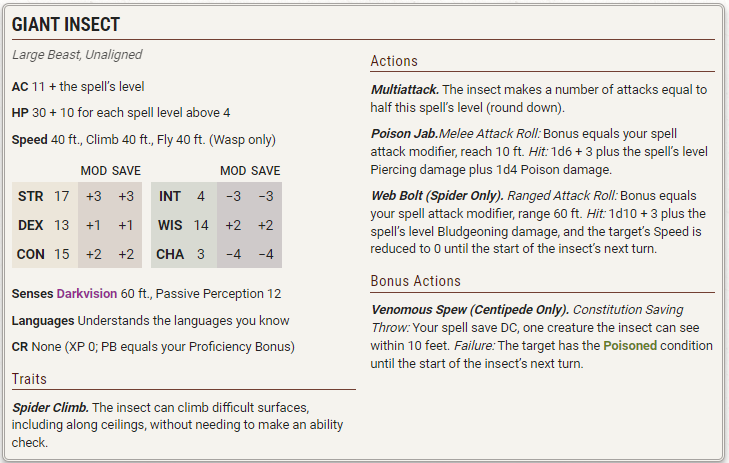

# Spells (G)

---

### Gaseous Form

*Level 3 Transmutation (Sorcerer, Warlock, Wizard)*

**Casting Time:** Action  
**Range:** Touch  
**Components:** V, S, M (a bit of gauze)  
**Duration:** Concentration, up to 1 hour

A willing creature you touch shape-shifts, along with everything it’s wearing and carrying, into a misty cloud for the duration. The spell ends on the target if it drops to 0 Hit Points or if it takes a Magic action to end the spell on itself.

While in this form, the target’s only method of movement is a Fly Speed of 10 feet, and it can hover. The target can enter and occupy the space of another creature. The target has Resistance to Bludgeoning, Piercing, and Slashing damage; it has Immunity to the Prone condition; and it has Advantage on Strength, Dexterity, and Constitution saving throws. The target can pass through narrow openings, but it treats liquids as though they were solid surfaces.

The target can’t talk or manipulate objects, and any objects it was carrying or holding can’t be dropped, used, or otherwise interacted with. Finally, the target can’t attack or cast spells.

***Using a Higher-Level Spell Slot.*** You can target one additional creature for each spell slot level above 3.

---

### Gate

*Level 9 Conjuration (Cleric, Sorcerer, Warlock, Wizard)*

**Casting Time:** Action  
**Range:** 60 feet  
**Components:** V, S, M (a diamond worth 5,000+ GP)  
**Duration:** Concentration, up to 1 minute

You conjure a portal linking an unoccupied space you can see within range to a precise location on a different plane of existence. The portal is a circular opening, which you can make 5 to 20 feet in diameter. You can orient the portal in any direction you choose. The portal lasts for the duration, and the portal’s destination is visible through it.

The portal has a front and a back on each plane where it appears. Travel through the portal is possible only by moving through its front. Anything that does so is instantly transported to the other plane, appearing in the unoccupied space nearest to the portal.

Deities and other planar rulers can prevent portals created by this spell from opening in their presence or anywhere within their domains.

When you cast this spell, you can speak the name of a specific creature (a pseudonym, title, or nickname doesn’t work). If that creature is on a plane other than the one you are on, the portal opens next to the named creature and transports it to the nearest unoccupied space on your side of the portal. You gain no special power over the creature, and it is free to act as the DM deems appropriate. It might leave, attack you, or help you.

---

### Geas

*Level 5 Enchantment (Bard, Cleric, Druid, Paladin, Wizard)*

**Casting Time:** 1 minute  
**Range:** 60 feet  
**Components:** V  
**Duration:** 30 days

You give a verbal command to a creature that you can see within range, ordering it to carry out some service or refrain from an action or a course of activity as you decide. The target must succeed on a Wisdom saving throw or have the Charmed condition for the duration. The target automatically succeeds if it can’t understand your command.

While Charmed, the creature takes 5d10 Psychic damage if it acts in a manner directly counter to your command. It takes this damage no more than once each day.

You can issue any command you choose, short of an activity that would result in certain death. Should you issue a suicidal command, the spell ends.

A Remove Curse, Greater Restoration, or Wish spell ends this spell.

***Using a Higher-Level Spell Slot.*** If you use a level 7 or 8 spell slot, the duration is 365 days. If you use a level 9 spell slot, the spell lasts until it is ended by one of the spells mentioned above.

---

### Gentle Repose

*Level 2 Necromancy (Cleric, Paladin, Wizard)*

**Casting Time:** Action or Ritual  
**Range:** Touch  
**Components:** V, S, M (2 Copper Pieces, which the spell consumes)  
**Duration:** 10 days

You touch a corpse or other remains. For the duration, the target is protected from decay and can’t become Undead.

The spell also effectively extends the time limit on raising the target from the dead, since days spent under the influence of this spell don’t count against the time limit of spells such as Raise Dead.

---

### Giant Insect

*Level 4 Conjuration (Druid)*

**Casting Time:** Action  
**Range:** 60 feet  
**Components:** V, S  
**Duration:** Concentration, up to 10 minutes

You summon a giant centipede, spider, or wasp (chosen when you cast the spell). It manifests in an unoccupied space you can see within range and uses the Giant Insect stat block. The form you choose determines certain details in its stat block. The creature disappears when it drops to 0 Hit Points or when the spell ends.

The creature is an ally to you and your allies. In combat, the creature shares your Initiative count, but it takes its turn immediately after yours. It obeys your verbal commands (no action required by you). If you don’t issue any, it takes the Dodge action and uses its movement to avoid danger.

***Using a Higher-Level Spell Slot.*** Use the spell slot’s level for the spell’s level in the stat block.

{ width: 120px; }

